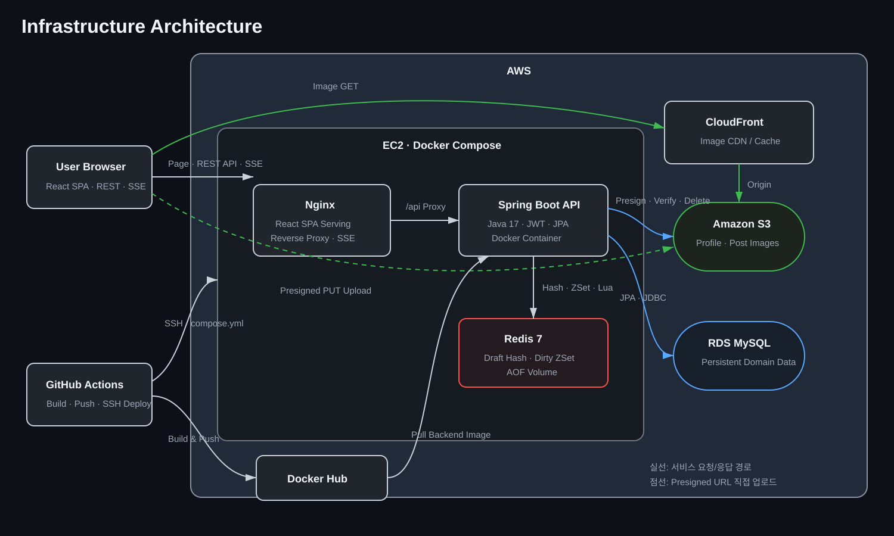
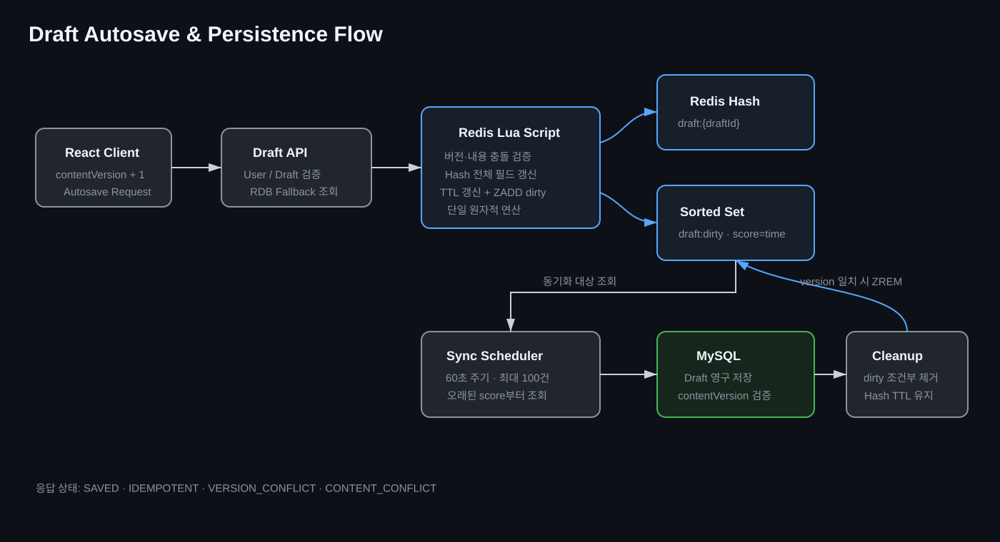
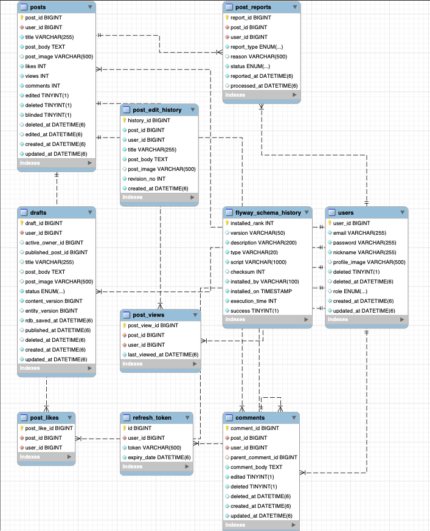
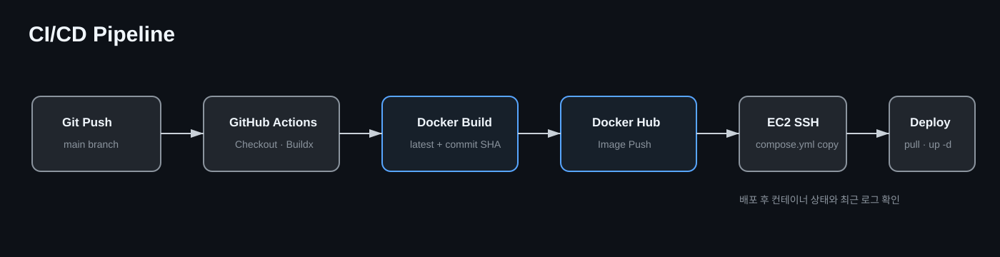

# 취업 시장에서 살아남기 — Backend

> 취업과 이직에 관한 정보와 고민을 함께 나누는 커뮤니티

## 프로젝트 소개

**취업 시장에서 살아남기**는 취업 혹은 이직을 준비하는 사람들이 서로 취업 시장 혹은 회사에 대한 정보를 공유하고, 취업과 이직에 대하여 가지고 있는 고민거리들을 공유하며 조언을 받을 수 있는 커뮤니티입니다.

이 저장소는 사용자·게시글·댓글·이미지 업로드 API와 인증·인가를 제공하는 백엔드 저장소입니다. 특히 작성 빈도가 높은 게시글 임시 저장 기능에 Redis를 도입하고, Redis와 MySQL 사이의 일관성·원자성·복구 가능성을 고려하여 설계했습니다.

## 핵심 구현

- 사용자, 게시글, 댓글, 임시글, 좋아요, 조회수, 신고 도메인 모델링
- Spring Security와 JWT Access/Refresh Token을 이용한 인증·인가
- 게시글·댓글 CRUD 및 작성자 기반 수정·삭제 권한 검증
- Redis Hash 기반 임시글 자동 저장과 TTL 관리
- Redis Sorted Set 기반 변경 대상 추적 및 MySQL 비동기 동기화
- Lua Script를 이용한 버전 검증, Hash 갱신, TTL 연장, dirty 등록의 원자적 처리
- 임시글 게시·삭제 이후 트랜잭션 커밋 시점에 Redis 데이터를 정리하여 정합성 보장
- Flyway를 이용한 데이터베이스 스키마와 인덱스 버전 관리
- Presigned URL 기반 S3 이미지 업로드 및 업로드 세션 검증
- RLock·WATCH/MULTI/EXEC·Lua Script 동시성 제어 방식 비교
- MySQL 인덱스 도입 전후 실행 계획 및 부하 테스트
- Testcontainers 기반 실제 MySQL 통합 테스트와 JaCoCo 리포트 생성
- Docker Compose, Docker Hub, AWS EC2/RDS/S3, GitHub Actions 기반 자동 배포

## 개발 인원 및 기간

### 개발 기간

- 2026.05.26 ~ 2026.08.09

### 개발 인원

- 프론트엔드 / 백엔드 1명 (본인)
- 개인 프로젝트

### 담당 범위

- 도메인 및 데이터베이스 모델링
- REST API 설계와 구현
- 인증 및 인가 구현
- Redis를 이용한 게시글 임시 저장 기능 구현
- 성능 테스트 및 부하 테스트
- 인프라 및 CI/CD 구성
- Docker 이미지 빌드 및 Docker Hub 배포
- GitHub Actions를 이용한 EC2 배포 자동화

## 사용 기술 및 Tools

| 구분 | 기술 및 도구 | 활용 |
|---|---|---|
| Language | Java 17 | 백엔드 애플리케이션 구현 |
| Framework | Spring Boot 4.0.6 | REST API, 스케줄러 및 애플리케이션 구성 |
| Security | Spring Security, JWT | Access/Refresh Token 인증 및 권한 검증 |
| ORM | Spring Data JPA, Hibernate | 도메인 엔티티 영속화와 데이터 접근 |
| Database | MySQL 8, AWS RDS | 서비스 데이터 영구 저장 |
| Cache | Redis 7, Spring Data Redis | 임시글 캐시, TTL 및 동기화 대상 관리 |
| Concurrency | Lua Script, Redisson RLock, WATCH/MULTI/EXEC | Redis 원자성 보장 방식 구현 및 비교 |
| Migration | Flyway | 스키마와 인덱스 변경 이력 관리 |
| Storage | AWS S3, Presigned URL | 이미지 직접 업로드 및 업로드 검증 |
| Test | JUnit 5, Spring Security Test, Testcontainers | 단위·인가·영속성 통합 테스트 |
| Performance | JMeter, EXPLAIN ANALYZE | 부하 테스트와 인덱스 성능 비교 |
| Coverage | JaCoCo | 테스트 커버리지 리포트 생성 |
| Build | Gradle | 의존성 관리, 테스트 및 애플리케이션 빌드 |
| Container | Docker, Docker Compose | 실행 환경 표준화와 서비스 통합 실행 |
| CI/CD | GitHub Actions, Docker Hub | 이미지 빌드·푸시 및 EC2 자동 배포 |
| Collaboration | Git, GitHub | 버전 관리와 소스 코드 관리 |

## 관련 저장소

- Frontend Repository: [KTB4_Neo_FE](https://github.com/100-hours-a-week/KTB4_Neo_FE)

## 폴더 구조

```text
.
├── .github/
│   └── workflows/
│       └── backend-ci-cd.yml
├── backend/
│   ├── gradle/
│   ├── src/
│   │   ├── main/
│   │   │   ├── java/com/ktb/community/
│   │   │   │   ├── benchmark/       # Redis 원자성 비교용 API
│   │   │   │   ├── domain/
│   │   │   │   │   ├── comment/     # 댓글 도메인
│   │   │   │   │   ├── draft/       # 임시글 저장·동기화·정리
│   │   │   │   │   ├── post/        # 게시글·좋아요·조회·신고
│   │   │   │   │   ├── upload/      # S3 이미지 업로드
│   │   │   │   │   └── user/        # 사용자와 인증 정보
│   │   │   │   ├── global/           # 공통 응답·설정·예외 처리
│   │   │   │   └── security/         # JWT 필터와 Spring Security
│   │   │   └── resources/
│   │   │       ├── db/migration/      # Flyway SQL
│   │   │       ├── redis/             # 임시글 Lua Script
│   │   │       └── application*.yaml
│   │   └── test/                       # 단위·통합·인가 테스트
│   ├── Dockerfile
│   └── build.gradle
├── docs/
│   └── diagrams/                        # README 다이어그램
├── performance-test/
│   ├── jmeter/                          # JMeter 테스트 계획
│   ├── sql/                             # EXPLAIN ANALYZE SQL
│   └── run-*.sh                         # 정확성·성능 테스트 실행 스크립트
├── compose.local.yml
├── compose.perf.yml
└── compose.yml
```

## 시스템 아키텍처

<p align="center">
  
</p>

- 페이지·REST API·SSE 요청은 EC2의 Nginx로 전달되며, `/api` 요청은 Spring Boot 컨테이너로 프록시됩니다.
- Spring Boot는 RDS MySQL에 도메인 데이터를 영구 저장하고 EC2 내부 Redis에 임시글을 캐싱합니다.
- 이미지 조회 요청은 CloudFront를 거쳐 S3 원본으로 전달되어 CDN 캐시를 활용합니다.
- Spring Boot가 Presigned URL을 발급하면 브라우저가 S3로 이미지를 직접 업로드하고, 백엔드는 업로드 검증과 삭제를 담당합니다.
- 운영 서비스는 Docker Compose 내부 네트워크에서 통신하며 외부에는 Nginx의 80번 포트만 공개합니다.
- GitHub Actions가 이미지를 Docker Hub에 푸시하고 SSH로 EC2의 컨테이너를 갱신합니다.

## 주요 기능

### 회원과 인증

- 회원가입, 로그인, 로그아웃 및 회원 탈퇴
- JWT Access Token과 Refresh Token 발급 및 재발급
- 비밀번호 암호화와 인증 실패 응답 처리
- 사용자 정보와 비밀번호 수정
- 작성자와 요청 사용자의 식별자를 비교한 리소스 접근 제어

### 게시글과 댓글

- 게시글 목록·상세 조회, 작성, 수정 및 논리 삭제
- 게시글 수정 이력과 수정 버전 보관
- 사용자별 좋아요 등록·취소 및 중복 방지
- 사용자별 조회 기록과 조회수 관리
- 신고 유형 조회와 게시글 신고 중복 방지
- 댓글·대댓글 작성, 수정, 삭제 및 작성자 권한 검증

### 이미지 업로드

- S3 Presigned URL 발급
- 업로드 목적, 파일 형식, 크기 및 만료 시간 검증
- 업로드 완료 요청을 통한 세션 확정
- 회원가입 이미지와 인증 사용자 이미지 업로드 경로 분리

### 게시글 임시 저장

<p align="center">
  
</p>

1. 사용자가 글쓰기를 시작하면 사용자당 하나의 `ACTIVE` Draft를 생성합니다.
2. 클라이언트는 변경할 때마다 증가시킨 `contentVersion`과 함께 자동 저장을 요청합니다.
3. Lua Script가 현재 버전과 내용을 검증하고 Redis Hash 갱신, TTL 연장, Sorted Set 등록을 하나의 원자적 연산으로 처리합니다.
4. 동일 요청은 멱등 처리하고 과거 버전 또는 같은 버전의 다른 내용은 충돌로 분류합니다.
5. Sync Scheduler는 1분마다 `draft:dirty` Sorted Set에서 오래된 score 순으로 최대 100개의 Draft ID만 가져옵니다. Sorted Set에는 임시글 본문이 저장되지 않습니다.
6. 조회한 ID로 `draft:{draftId}` Redis Hash를 읽고, Hash의 최신 스냅샷과 `contentVersion`을 MySQL Draft에 저장합니다.
7. MySQL 트랜잭션 커밋 후 저장 버전과 Redis 최신 버전이 일치할 때만 `draft:dirty`의 해당 ID를 제거합니다. 동기화 중 새 자동 저장이 발생했다면 dirty 항목을 유지합니다.
8. 동기화가 완료돼도 Redis Hash는 즉시 삭제하지 않고 3일 TTL 동안 유지하여 이어쓰기와 복구에 사용합니다.
9. 사용자가 임시글을 게시하거나 삭제하면 RDB 트랜잭션 커밋 이후 Redis Hash와 dirty 항목을 함께 정리합니다.
10. Cleanup Scheduler는 하루마다 MySQL에서 보존 기간 7일이 지난 비활성 Draft를 최대 100건씩 물리 삭제하며, Redis Sorted Set 정리와는 별개의 역할입니다.

## 주요 기술적 개선

### 임시글 저장소로 Redis를 선택한 이유

자동 저장은 사용자가 입력하는 동안 짧은 주기로 반복되므로 일반 게시글 작성보다 쓰기 요청이 훨씬 많이 발생합니다. 모든 변경을 즉시 MySQL에 반영하면 디스크 I/O와 트랜잭션 비용이 증가하고, 자동 저장 트래픽이 핵심 조회·작성 기능의 데이터베이스 자원을 함께 점유할 수 있습니다.

Redis를 쓰기 버퍼로 두어 자동 저장 요청을 메모리에서 빠르게 처리하고, 변경된 Draft만 일정 주기로 MySQL에 묶어 반영하도록 구성했습니다. Redis AOF와 Draft Hash TTL을 적용하고 RDB 스냅샷을 복구 기준으로 사용하여 캐시 유실과 장기 미사용 데이터도 고려했습니다.

### 자동 저장에 Hash 자료 구조를 선택한 이유

하나의 임시글은 `title`, `postBody`, `postImage`, `contentVersion`, `updatedAt`처럼 이름이 있는 여러 필드로 구성됩니다. Redis Hash는 `draft:{draftId}` 하나에 필드 단위로 데이터를 표현할 수 있어 문자열 JSON보다 구조와 의도가 명확합니다.

- 임시글 단위 조회와 삭제가 간단합니다.
- 필드 이름이 데이터에 포함되어 역직렬화 없이 필요한 값을 검증할 수 있습니다.
- Lua Script 안에서 현재 버전과 내용을 직접 비교할 수 있습니다.
- 하나의 키에 TTL을 적용해 임시글 전체의 만료 시점을 일관되게 관리할 수 있습니다.
- Hash 갱신과 TTL 연장, dirty 등록을 단일 Lua Script로 묶기 좋습니다.

자동 저장 과정에서는 일부 필드만 변경하더라도 요청 스냅샷 전체를 저장합니다. 이를 통해 서로 다른 시점의 필드가 섞이는 부분 갱신 문제를 방지하고 하나의 `contentVersion`이 하나의 완전한 Draft 상태를 나타내도록 했습니다.

### RDB 동기화 대상을 Sorted Set으로 관리한 이유

변경된 Draft ID만 별도 `draft:dirty` Sorted Set에 저장하고, 마지막 변경 시각의 Epoch Millisecond를 score로 사용했습니다. 실제 제목·본문·이미지·버전은 Sorted Set이 아닌 `draft:{draftId}` Hash에 저장됩니다.

- Sync Scheduler가 변경된 Draft ID만 조회하므로 Redis 전체 키 스캔이 필요하지 않습니다.
- score 범위 조회로 일정 시간 이상 지난 Draft만 동기화할 수 있습니다.
- 오래된 변경부터 정렬된 순서로 처리할 수 있습니다.
- `LIMIT`을 적용해 한 번에 처리할 동기화 배치를 제한할 수 있습니다.
- 같은 Draft가 여러 번 저장돼도 member가 중복되지 않고 score만 최신 시각으로 갱신됩니다.
- 새로운 자동 저장이 발생하면 score가 뒤로 이동하므로 입력 중인 Draft의 불필요한 RDB 쓰기를 줄일 수 있습니다.
- MySQL 커밋 후 버전 일치가 확인된 항목만 Sync 로직에서 제거하므로 동기화 도중 발생한 최신 변경을 보존합니다.

### Lua Script를 이용한 원자성 보장

자동 저장에는 버전 확인, 내용 충돌 확인, Hash 저장, TTL 연장, Sorted Set 등록이 함께 필요합니다. 이를 여러 Redis 명령으로 분리하면 명령 사이에 다른 요청이 개입해 부분 저장이나 최신 데이터 덮어쓰기가 발생할 수 있습니다.

Lua Script로 전체 과정을 Redis 서버 내부의 단일 원자적 연산으로 실행하고 결과를 `SAVED`, `IDEMPOTENT`, `VERSION_CONFLICT`, `CONTENT_CONFLICT`로 구분했습니다. 동기화 완료 후 dirty 항목을 제거할 때도 저장한 버전과 현재 Redis 버전이 일치하는 경우에만 제거하는 별도의 Lua Script를 사용했습니다.

## 테스트

### 인덱스 도입 성능 테스트

사용자·게시글·댓글 조회에서 반복되는 검색 조건과 정렬 조건을 분석하고, 데이터 증가 시 발생하는 Full Table Scan과 정렬 비용을 줄이기 위해 복합 인덱스를 도입했습니다.

#### 테스트 설계

- 운영 배포와 분리된 `compose.perf.yml` 환경에서 MySQL과 Redis를 실행했습니다.
- Flyway V1만 적용한 상태를 A, V2 인덱스까지 적용한 상태를 B로 정의했습니다.
- 동일한 seed dump와 HikariCP 설정을 사용해 비교 조건을 고정했습니다.
- 측정 중 Draft 동기화·정리 스케줄러가 개입하지 않도록 성능 프로필의 실행 주기를 365일로 설정했습니다.
- `EXPLAIN ANALYZE`로 접근 방식과 읽은 행을 비교하고, JMeter 단일 스레드로 API 지연시간을 확인했습니다.
- 초기 30스레드 테스트는 DB 인덱스 외의 애플리케이션 자원 경합이 결과를 지배해 비교 목적에 맞지 않았으므로 최종 분석에서 제외했습니다.

#### 적용 인덱스

| 인덱스 | 구성 컬럼 | 개선 대상 |
|---|---|---|
| `idx_users_email_deleted` | `(email, deleted)` | 활성 사용자 이메일 조회 |
| `idx_users_nickname_deleted` | `(nickname, deleted)` | 활성 사용자 닉네임 조회 |
| `idx_posts_deleted_created_at` | `(deleted, created_at DESC)` | 게시글 목록 필터링과 최신순 정렬 |
| `idx_posts_user_created_at` | `(user_id, created_at)` | 사용자별 기간 내 게시글 수 조회 |
| `idx_comments_post_created_at` | `(post_id, created_at)` | 게시글별 댓글 조회와 작성순 정렬 |
| `idx_comments_user_deleted_post` | `(user_id, deleted, post_id)` | 사용자·삭제 여부·게시글 조건 조회 |

#### EXPLAIN ANALYZE 결과

| 조회 | 적용 전 | 적용 후 | SQL 실행시간 변화 |
|---|---|---|---:|
| 활성 사용자 이메일 | 사용자 10,000행 Table Scan | Covering Index 1행 | `15.3ms → 0.0186ms` **99.88% 감소** |
| 활성 사용자 닉네임 | 사용자 10,000행 Table Scan | Covering Index 1행 | `1.99ms → 0.00354ms` **99.82% 감소** |
| 게시글 첫 페이지 | 게시글 100,000행 스캔·필터·정렬 | 인덱스에서 20행 조회 | `126ms → 0.0421ms` **99.97% 감소** |
| 게시글 깊은 페이지 | 100,000행 스캔, 80,020행 정렬 | 인덱스 80,020행 조회 | `41.7ms → 8.16ms` **80.43% 감소** |
| 사용자 기간별 게시글 수 | FK 조회 후 날짜 필터 | 복합 범위 인덱스 | `3.08ms → 1.12ms` **63.64% 감소** |
| 일반 댓글 | 10행 조회 후 별도 정렬 | 인덱스 순서로 10행 반환 | `2.39ms → 0.0465ms` **98.05% 감소** |
| 댓글 1,005건 게시글 | 1,005행 조회 후 955행 정렬 | 정렬 없이 955행 반환 | `1.83ms → 0.561ms` **69.34% 감소** |

#### 결과 분석

- 게시글 첫 페이지는 전체 스캔과 정렬이 제거됐고, JMeter API p50도 `123ms → 25ms`로 **79.7% 감소**했습니다.
- SQL 개선율보다 API 개선율이 작은 이유는 인증, JPA 매핑, 작성자 JOIN, 추가 조회와 JSON 직렬화 비용이 그대로 남기 때문입니다.
- 깊은 페이지는 정렬이 제거됐지만 `OFFSET 80000`을 처리하려면 여전히 인덱스 80,020개를 읽어야 했습니다. 인덱스만으로 깊은 페이지 문제를 완전히 해결할 수 없으며 추후 Cursor 기반 페이지네이션을 고려할 수 있습니다.
- 댓글 조회는 접근 행 수가 같아도 `created_at` 순서의 인덱스를 사용하면서 별도 정렬이 제거됐습니다. 일반 댓글 API p50은 `10ms → 6ms`, 댓글 955건 API p50은 `29ms → 24ms`, p95는 `57.3ms → 46.4ms`로 감소했습니다.
- SQL 실행시간과 API 응답시간을 분리해 측정함으로써 인덱스가 개선한 영역과 애플리케이션에 남은 비용을 구분했습니다.

상세 과정과 실행계획은 [Index 추가하여 조회 성능 개선](https://app.notion.com/p/3b54c7f9a749801487cfe156cc76d1a9)에서 확인할 수 있습니다.

### Lua Script를 사용한 이유

임시글 자동 저장은 현재 Hash 조회, 요청 버전 비교, 조건부 갱신, TTL 연장, dirty Sorted Set 등록을 하나의 논리적 작업으로 처리해야 합니다. 이 과정의 정합성과 비용을 확인하기 위해 Lua Script, WATCH + MULTI + EXEC, Redisson RLock에 동일한 기능 규칙과 부하를 적용해 비교했습니다.

#### 공통 기능 규칙

| 조건 | 기대 결과 | Redis 변경 |
|---|---|---|
| 요청 버전 > 저장 버전 | `SAVED` | Hash·TTL·dirty 갱신 |
| 요청 버전 < 저장 버전 | `VERSION_CONFLICT` | 변경 없음 |
| 같은 버전·같은 내용 | `IDEMPOTENT` | 내용 변경 없음 |
| 같은 버전·다른 내용 | `CONTENT_CONFLICT` | 변경 없음 |

성공 저장은 Hash 저장, TTL 3일 갱신, dirty 등록을 모두 수행하도록 통일했습니다. dirty 제거도 Redis 버전과 RDB 버전의 관계에 따라 동일한 결과를 내도록 세 전략을 구현했습니다.

#### 테스트 조건

| 항목 | 조건 |
|---|---|
| 부하 | 시나리오별 10스레드, 총 50스레드 |
| Ramp-up | 10초 |
| 워밍업 | 전략별 60초 1회 |
| 본 측정 | 전략별 180초 × 독립 5회 |
| WATCH | 요청당 최대 5회 시도 |
| RLock | 최대 획득 대기 5초, lease time 미지정 |
| 애플리케이션 | CPU 1 Core, Memory 1GiB |
| Redis | CPU 0.5 Core, Memory 512MiB, Redis 7 Alpine, AOF 활성화 |

JWT, MySQL fallback과 Draft Scheduler의 영향을 제거하고 HTTP·Spring MVC·JSON 비용은 세 전략에 동일하게 유지했습니다. 실행 순서는 전략별 시간 효과를 줄이기 위해 매 회차 교차했습니다.

#### 정합성 검증 결과

| 항목 | Lua | WATCH | RLock |
|---|---:|---:|---:|
| Stale overwrite | 0 | 0 | 0 |
| Latest dirty loss | 0 | 0 | 0 |
| Partial Hash update | 0 | 0 | 0 |
| Hash 저장 후 dirty 누락 | 0 | 0 | 0 |
| JMeter HTTP 오류 | 0 | 0 | 0 |
| WATCH 5회 시도 소진 | - | 134 | - |
| RLock timeout | - | - | 0 |

세 전략 모두 결정적 동시성 시험에서 데이터 정합성 오류가 발생하지 않았습니다. WATCH의 134건은 오래된 데이터로 덮어쓴 오류가 아니라 충돌 후 5회 안에 `EXEC`하지 못해 안전하게 포기한 요청이며, 자동 저장 1,632,895건의 약 **0.0082%**였습니다.

#### 5회 평균 성능

| 지표 | Lua Script | WATCH + MULTI + EXEC | Redisson RLock |
|---|---:|---:|---:|
| 총 요청 수 | **2,465,097** | 1,959,934 | 771,562 |
| 평균 TPS | **2,737.9** | 2,175.0 | 853.5 |
| TPS 중앙값 | **2,762.1** | 2,210.5 | 888.8 |
| 평균 응답 시간 | **17.65ms** | 22.45ms | 56.87ms |
| p50 | **4.2ms** | 4.8ms | 8.0ms |
| p95 | **83.8ms** | 86.8ms | 203.6ms |
| p99 | **91.0ms** | 94.4ms | 359.6ms |
| 최대 응답 시간 평균 | **491.4ms** | 657.6ms | 1,195.2ms |
| 평균 Redis CPU | **10.22%** | 12.76% | 21.58% |

#### 전략별 해석

| 전략 | 동작 방식 | 결과와 트레이드오프 |
|---|---|---|
| Lua Script | 조회·비교·조건부 변경을 Redis 서버에서 한 번에 실행 | 가장 높은 처리량과 가장 낮은 지연·Redis CPU. 추가 왕복과 외부 락이 없음 |
| WATCH | 감시 후 MULTI/EXEC, 충돌 시 최대 5회 재시도 | 정합성은 유지했지만 재시도 왕복과 연결 풀 관리가 필요하고 134건이 시도 한도 소진 |
| RLock | Draft별 분산락 획득 후 임계 구역 직렬화 | Timeout 없이 안전했지만 락 대기와 획득·해제 통신으로 처리량과 Tail Latency가 가장 불리 |

#### 최종 선택

Lua는 WATCH보다 평균 처리량이 **25.9% 높고** 평균 응답 시간이 **21.4% 낮았습니다**. RLock보다 평균 처리량이 **220.8% 높고** 평균 응답 시간이 **69.0% 낮았습니다**. 현재 문제는 Redis 내부에서 끝나는 짧고 경합 가능한 조건부 갱신이므로, 정합성 오류 없이 가장 단순한 왕복 구조와 우수한 성능을 보인 Lua Script를 선택했습니다.

이 결과는 로컬 Docker와 제한된 CPU 환경에서 수행한 상대 비교이며 운영 환경의 절대 TPS를 의미하지 않습니다. 단일 Redis 기준이므로 Redis Cluster를 도입한다면 Script가 사용하는 키의 Hash Slot도 함께 설계해야 합니다.

상세 결과는 [Lua·WATCH·RLock 테스트 결과 및 분석](https://app.notion.com/p/3b64c7f9a7498107adf3d5d1f52dde3c)에서 확인할 수 있습니다.

#### 재현 자료

- `performance-test/jmeter/before-index-read.jmx`
- `performance-test/sql/index-explain.sql`
- `performance-test/sql/comment-user-index-explain.sql`
- `performance-test/jmeter/draft-atomicity-comparison.jmx`
- `performance-test/run-draft-atomicity-correctness.sh`
- `performance-test/run-draft-atomicity-benchmark.sh`
- `performance-test/analyze-draft-atomicity-results.py`

## 데이터베이스 설계

### DB 설계 요구 사항 분석

- 이메일과 닉네임은 중복될 수 없으며 탈퇴 여부를 함께 조회할 수 있어야 합니다.
- 사용자는 여러 게시글과 댓글을 작성할 수 있습니다.
- 댓글은 자기 참조 관계를 통해 대댓글을 가질 수 있습니다.
- 사용자는 하나의 게시글에 좋아요와 신고를 각각 한 번만 등록할 수 있습니다.
- 사용자별 게시글 조회 시각을 저장해 중복 조회 증가를 제어할 수 있어야 합니다.
- 게시글 수정 전 내용을 이력으로 남기고 게시글별 revision 순서를 보장해야 합니다.
- 사용자는 동시에 하나의 활성 임시글만 소유할 수 있어야 합니다.
- 임시글은 `ACTIVE`, `PUBLISHED`, `DELETED` 상태와 내용 버전을 가져야 합니다.
- 삭제 데이터는 즉시 물리 삭제하지 않고 삭제 여부와 시각을 기록할 수 있어야 합니다.
- 생성·수정 시각을 공통 관리하고 자주 사용하는 조회 조건에는 복합 인덱스를 적용해야 합니다.

### ERD

> MySQL Workbench에서 생성한 `ERD.png`를 `docs/ERD.png`에 추가하면 아래에 표시됩니다.

<p align="center">
  
</p>

### 주요 테이블

| 테이블 | 설명 | 주요 관계 및 제약 |
|---|---|---|
| `users` | 사용자 계정과 프로필, 권한, 탈퇴 상태 | 이메일·닉네임 중복 검증 |
| `posts` | 게시글 본문, 이미지, 집계값 및 상태 | 사용자와 N:1 |
| `comments` | 댓글과 대댓글 | 게시글·사용자 N:1, 부모 댓글 자기 참조 |
| `refresh_token` | 사용자별 Refresh Token | 사용자당 하나의 토큰 |
| `post_likes` | 사용자별 게시글 좋아요 | `(post_id, user_id)` UNIQUE |
| `post_views` | 사용자별 마지막 게시글 조회 시각 | `(post_id, user_id)` UNIQUE |
| `post_reports` | 게시글 신고 유형과 처리 상태 | `(post_id, user_id)` UNIQUE |
| `post_edit_history` | 게시글 수정 전 스냅샷 | `(post_id, revision_no)` UNIQUE |
| `drafts` | 임시글 RDB 스냅샷과 버전·상태 | 사용자당 하나의 ACTIVE Draft |

## CI/CD 및 배포

<p align="center">
  
</p>

1. `main` 브랜치의 백엔드 또는 배포 설정 변경이 GitHub Actions를 실행합니다.
2. Buildx로 Spring Boot 백엔드 이미지를 빌드합니다.
3. Docker Hub에 `latest`와 Git commit SHA 태그를 함께 푸시합니다.
4. GitHub Actions가 SSH로 EC2에 접속해 운영 `compose.yml`을 복사합니다.
5. EC2가 최신 백엔드 이미지를 pull하고 해당 서비스만 다시 생성합니다.
6. 애플리케이션 시작 후 컨테이너 상태와 최근 로그를 확인합니다.


## 시연 영상

[▶ 취업 시장에서 살아남기 커뮤니티 시연 영상 보기](https://drive.google.com/file/d/1Dpoz2A1k0AMMIscnYaL7kGREoHJNB_aO/view?usp=drive_link)


## 회고

이번 프로젝트에서는 기능을 구현하는 것만큼 도메인과 데이터 흐름을 먼저 설계하는 일이 중요하다는 것을 배웠습니다. 요구사항을 구체적인 API와 데이터베이스 명세로 정리하는 과정이 구현 중 발생할 수 있는 모호함을 줄이는 경험을 했습니다.
특히 게시글 임시 저장은 단순히 Redis에 데이터를 저장하는 기능이 아니라 버전 관리, 원자성, 복구, 만료 처리와 RDB 동기화까지 함께 고려해야 했으며, 이를 통해 하나의 기능도 여러 시스템 간의 데이터 흐름을 기준으로 설계해야 한다는 점을 배웠습니다.
Redis의 Hash와 Sorted Set을 역할에 따라 분리하면서 자료구조 선택이 애플리케이션의 처리 흐름과 성능에 직접적인 영향을 준다는 점도 체감했습니다. 또한 Lua Script를 사용해 여러 Redis 명령을 하나의 원자적 연산으로 묶고, 동시 요청 상황에서도 최신 임시글이 덮어써지지 않도록 보호하는 방법을 배웠습니다.
익숙한 기술을 바로 선택하기보다 Lua, RLock, WATCH + MULTI + EXEC를 동일한 조건에서 비교하면서 기술 선택에는 측정 가능한 근거가 필요하다는 것을 배웠고, 성능 수치만 비교하는 것이 아니라 정확성 검증과 네트워크 시간을 포함한 전체 응답 시간, 서버 내부 연산 시간을 구분해야 올바른 판단을 할 수 있다는 점을 경험할 수 있었습니다.
MySQL 인덱스 역시 무조건 추가하는 것이 아니라 실제 조회 조건과 실행 계획을 먼저 확인하고, 적용 전후의 결과를 비교하는 과정이 중요했습니다. 이를 통해 성능 개선은 코드나 설정을 변경하는 것에서 끝나는 것이 아니라, 변화가 실제로 효과가 있었는지 검증하는 과정까지 포함해야한다는 점을 깨닫게 되었습니다.
돌이켜보면 개발 계획, API 명세, DB 설계서와 테스트 시나리오를 구현 전에 더 구체적으로 작성했다면 개발과 검증을 더욱 효율적으로 진행할 수 있었을 것 같습니다. 구현 과정에서 발생한 문제를 해결하는 것뿐만 아니라, 문제가 발생하기 전에 도메인 규칙과 예외 상황을 설계하는 습관의 중요성을 알게 되었고,
앞으로는 구현 결과만 제시하는 개발자가 아니라, 설계 의도와 기술 선택의 근거를 문서로 남기고 성능과 안정성을 재현 가능한 테스트로 검증하는 백엔드 개발자가 되고자 합니다.
